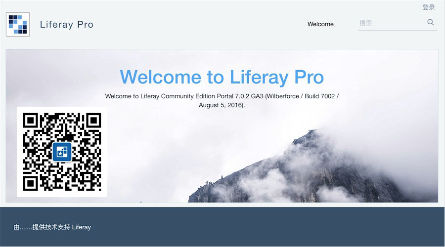
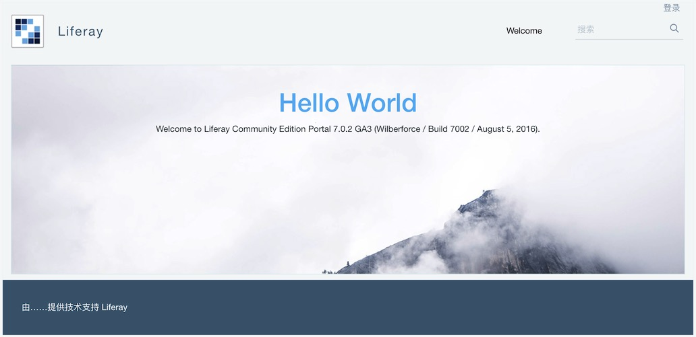
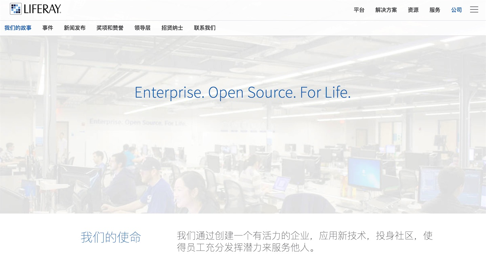

# 欢迎关注 Liferay Pro

## 关于 Liferay Pro
Liferay Pro 是由一位 Liferay Portal 技术爱好者创建的非官方公众号。Liferay Pro，是 Liferay Portal Professional 的简写，是 Liferay Portal 专业人员的意思。

Liferay Portal 是一个能够帮助我们专注于业务，高效完成工作，有更多时间享受生活、陪伴家人的平台。建立 Liferay Pro 公众号的初衷就是希望为 Liferay Portal 管理员/开发者以及正在踏上 Liferay Portal 学习之路的小伙伴们提供更加方便的交流、分享与学习的地方，帮助大家更加了解 Liferay Portal 及它背后的理念，更顺畅地学习 Liferay Portal 技术，逐步成为 Liferay Portal 专业人员，体会到站在巨人肩上 Coding 的乐趣。

## 关于 Liferay Portal
Liferay Portal 是 Liferay 公司的核心产品。

事实上，Liferay Portal 甚至早于 Liferay 公司诞生。Liferay Portal 始创于 2000 年，丰富的开放源码为组织提供业界无可匹敌的创新和灵活性水平。经过近十年来与积极成熟开源社区的协作，Liferay 产品开发是吸取了各行各业使用者所提出意见的结晶。正是这个原因使得 Liferay Portal 拥有杰出的用户体验、用户界面、技术和业务双重灵活性。

Liferay Portal 既是一个开源门户网站建设工具，同时也是一个基于 Java 架构的 Web 应用程序开发平台。它提供了一个强大的平台来快速构建网站，并且能够服务于所有的客户端，包括桌面、平板及手机等。它不仅具有强大的网站内容管理和基于文件的文档管理功能，而且集成了协作套件、开放社交、应用开发、权限管理、工作流、知识库、规则引擎和搜索引擎等 J2EE 应用程序。更重要的是，Liferay Portal 是一个完成可定制的，并且提供了免费的开源社区版，我们可以基于它来实现我们想要的任何功能。

通常，我们也习惯简称 Liferay Portal 为 Liferay。

Liferay Portal CE 最新版本是 2016 年 8 月 16 日发布的 7.0 GA3（7.0.2），可以从 [SourceForge](https://sourceforge.net/projects/lportal/)  下载。

## 关于 Liferay

对 Liferay Portal 需求的日益增长，促使了 Liferay 公司的诞生。Liferay 公司成立于 2004 年，总部位于美国洛杉矶，主要为各行各业的企业提供专业的低成本的门户解决方案以及高灵活性的服务。商业化的运作使得 Liferay Portal 技术发展更加迅速。直至今天 Liferay Portal 已经发展了十四个年头，成为世界范围内各个组织创建门户网站的最佳选择。从 2010 年开始连续七年，Liferay 一直都是 Gartner 水平门户魔力象限中的领导者，Liferay 在 「合作伙伴和供应商门户」、「数字化工作场所以」及「作为常用架构性框架的门户」等方面表现非常突出，这也说明了 Liferay 的技术平台作为关键技术跨多个受众和业务部门服务整个企业的优势。

有很多企业都使用了 Liferay Portal，比如国外的 Walmart（沃尔玛）、Toyota（丰田）、HP（惠普）、McDonald's（麦当劳）等，国内的广州白云国际机场、中国国家数字图书馆、大连市民政局、昆钢控股等。

此外，Liferay 还是一家热衷于公益慈善的公司。Liferay 公司成立的初衷超于利益，不仅会把利润的 10% 用于全球各地的慈善事业，还鼓励员工到被认可的非营利性组织当志愿者。每个季度，Liferay 内部员工自主地将一部分收入捐赠给慈善事业。这样的善举加强了 Liferay 公司与非盈利组织、社区的关系，提高了企业的声誉和员工的素质，激发了员工的工作热情，也逐渐形成了 Liferay 公司独特的竞争优势。

## 交流方式

目前，提供了以下几种沟通交流方式，总有一种适合您：
- **微信公众号**：liferaypro  

- **QQ 群**：622089162  

- **Slack Team**：https://liferaypro.slack.com/
- **BearyChat Team**：https://liferaypro.bearychat.com/
- **Github**：https://github.com/liferaypro
